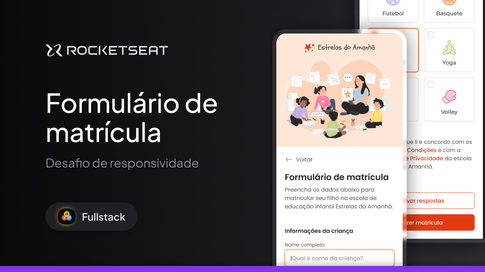

<h1 align="center"> Practical Challenge: Responsiveness - Registration form </h1>

This is the practical challenge of the Fullstack Training from Rocketseat. The goal is to transform layouts that are not yet responsive into responsive layouts. This form simulates the fields to be filled in to enroll a child in a preschool.

  <a href="#-tecnologias">Technologies</a>&nbsp;&nbsp;&nbsp;|&nbsp;&nbsp;&nbsp;
  <a href="#-projeto">Project</a>&nbsp;&nbsp;&nbsp;|&nbsp;&nbsp;&nbsp;
  <a href="#-layout">Layout</a>&nbsp;&nbsp;&nbsp;|&nbsp;&nbsp;&nbsp;
  <a href="#memo-licença">License</a>

  

 

  

## 🚀 Technologies
This project was developed with the following technologies:
- HTML and CSS
- Git and Github
- Figma
- Responsively App

## 💻 Project
This project involved designing and implementing a responsive layout for a form registration, ensuring compatibility with mobile and desktop devices. The focus was on maintaining a visually appealing and functional user interface that adapts seamlessly to different screen sizes, prioritizing usability and accessibility.

In this version, I managed to solve a compatibility issue in iOS 16. I used plain CSS, without nested CSS.

- [Access the finished project]()
- [Watch the classes](https://www.rocketseat.com.br/formacao/fullstack)

## 🔖 Layout
You can view the project layout through [LINK](https://www.figma.com/community/file/1392235383386426797). You must have an account on [Figma](https://figma.com) to access it.

## :memo: License
This project is under the MIT license.

---
Made with ♥ by Rocketseat :wave: [Join our community!](https://discord.gg/rocketseat)